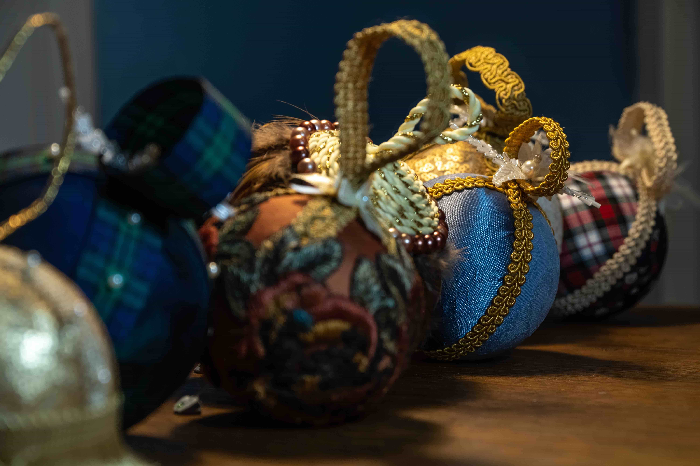

 here is a sentence or two about the project image you are currently looking at. isn't it great?!?!

 here is a sentence or two about the project image you are currently looking at. isn't it great?!?!

 here is a sentence or two about the project image you are currently looking at. isn't it great?!?!

 here is a sentence or two about the project image you are currently looking at. isn't it great?!?!
